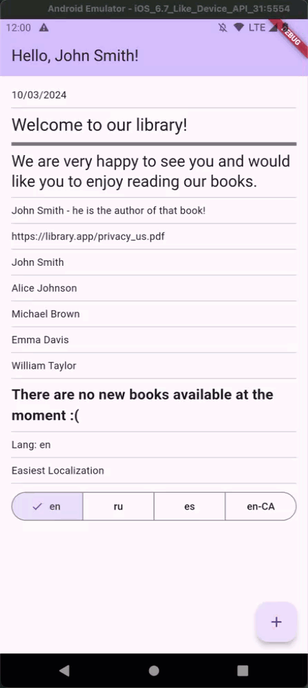

# Localization Battle: Easiest Localization Application Example

This application demonstrates three different approaches to localizing Flutter applications:

1. The `flutter_localizations` package, which is part of the Flutter SDK.
2. The `easy_localization` package, currently the most popular solution for localization.
3. The [`easiest_localization`](https://pub.dev/packages/easiest_localization) package, the most advanced and easiest solution for localization + [`easiest_remote_localization`](https://pub.dev/packages/easiest_remote_localization) - companion to support remote localization files as a source

| Flutter Localizations               | Easy Localization                                                 | Easiest Localization                                      |
|-------------------------------------|-------------------------------------------------------------------|-----------------------------------------------------------|
|  |  |  |

An article providing an in-depth explanation of this topic will be published soon!